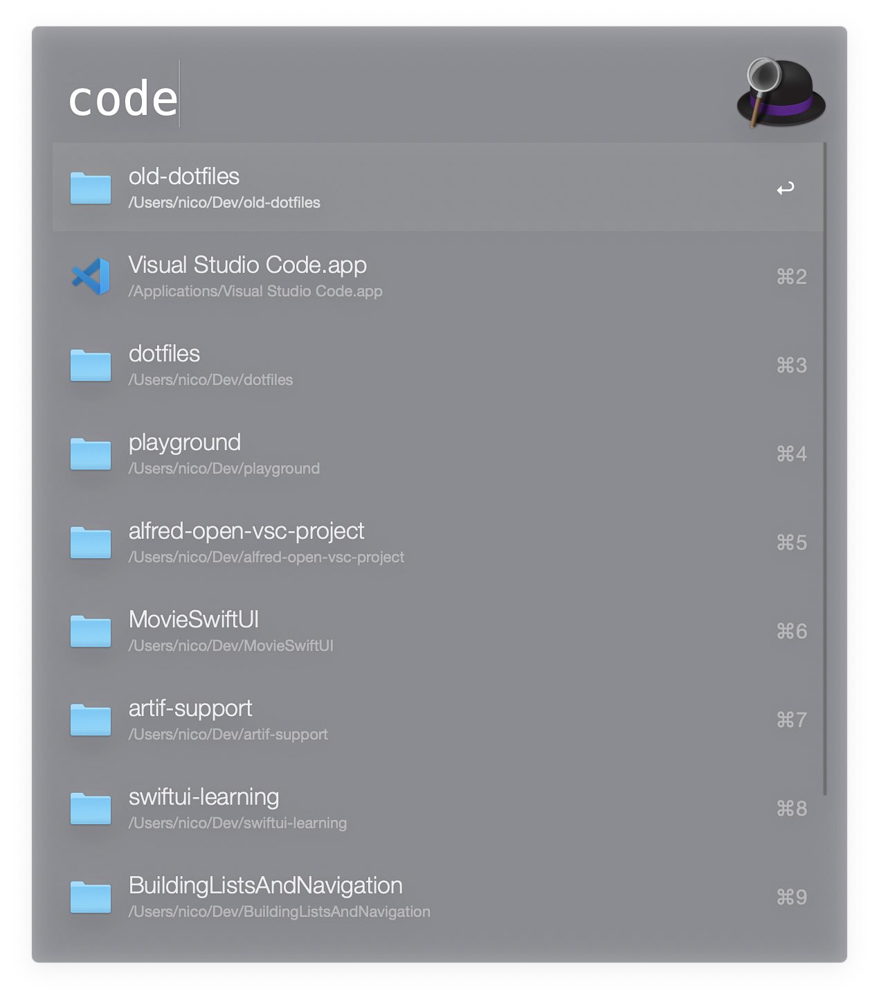

# Alfred workflow: Open Visual Studio Code project

This tiny [Alfred](https://www.alfredapp.com/) workflow ``alfred-open-vsc-project`` allows you to conveniently open a project via Visual Studio Code by defining a "workspace" folder (e.g. the folder where all your projects are). It then shows you all folder names and lets you filter them.

On selecting one, Visual Studio Code will automatically open with the selected project.

Note: This can easily be customized to open the project with another IDE/editor. Just edit the workflow's last step in Alfred to use another command then ``code``.

## Demo

## Installation

1. Download the ``open-vsc-project.alfredworkflow`` from Releases.
2. Drag-and-drop it to your Alfred workflows.
3. Set up the ``projectFolder`` and ``nodeExecutable`` variables. 

## Usage

1. Type ``dev`` into Alfred. It should show you your projects.
2. Select one with ``Enter``.
3. Voilá, Visual Studio Code now opens with your selected project!

## Development

This workflow basically consists of a simple node script bundled as an executable. To develop and build it, ``node`` and [nexe](https://github.com/nexe/nexe) are required.

You can build the workflow yourself with ``npm run build``.

### Debugging

There's a tiny debug mode included. You can run the script with ``npm run debug`` to see some debug outputs.

## Todos and Ideas

1. I'd like to eventually convert this node-thingy into a basic bash, ruby or python script (comes pre-installed with Mac OS). Currently, it's rather heavy for a simple script that basically only returns an Alfred-compatible JSON object of directories, but node.js was the easiest way to accomplish this when I was making it.
2. Open Terminal/iTerm in the project folder at the same time. (I tried to do this, but I didn't manage to make it work)

## License

This project is licensed under the MIT License - see the [LICENSE.md](LICENSE.md) file for details